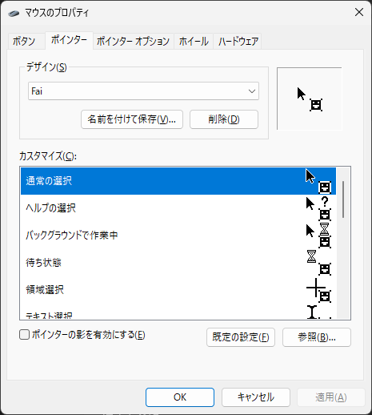

# fai-mouse-cursor
ファイのアイコンをマウスカーソルにしました。

## プレビュー

## 使い方
マウスの設定からダウンロードしてきた「.cur」ファイルをマウスカーソルに設定してください。

名前を付けて保存、としてテンプレートを保存することをお勧めします。

### Windows11の場合
設定→Bluetoothとデバイス→マウス→マウスの追加設定
からマウスのプロパティのウィンドウを開くことができます。